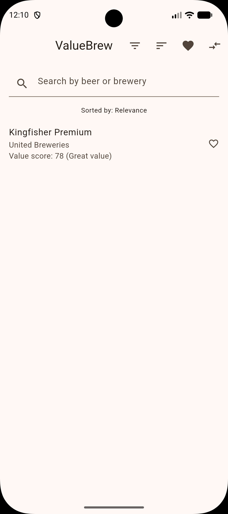
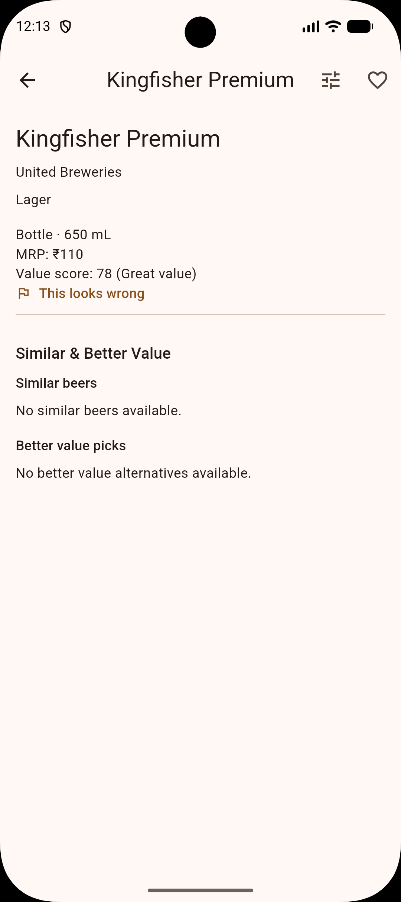
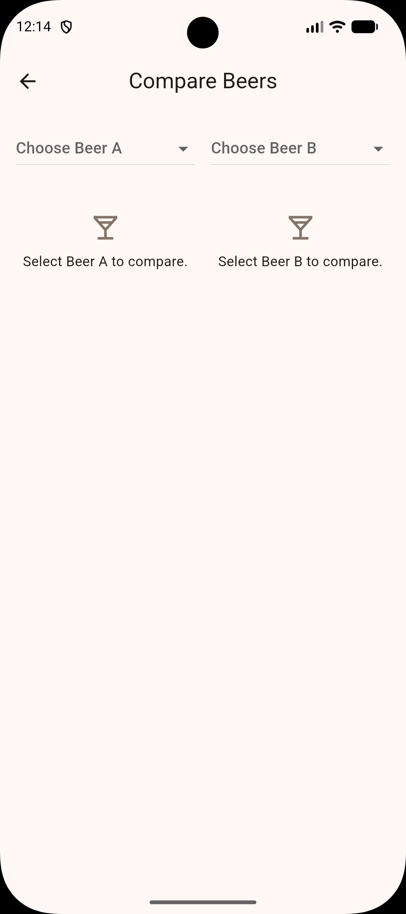
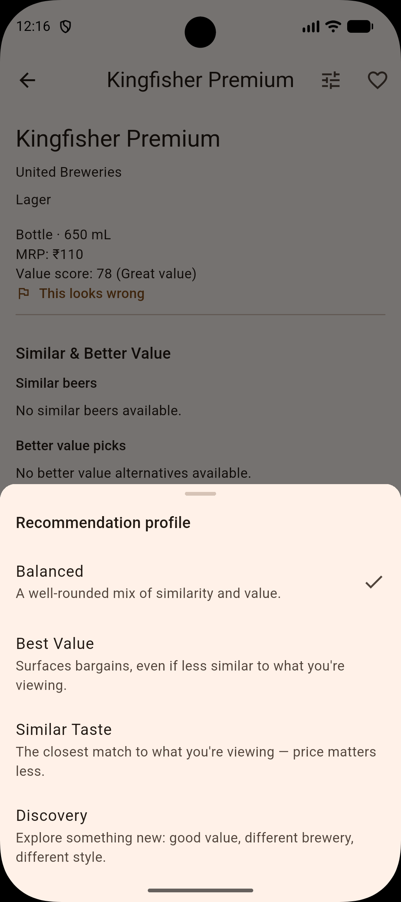
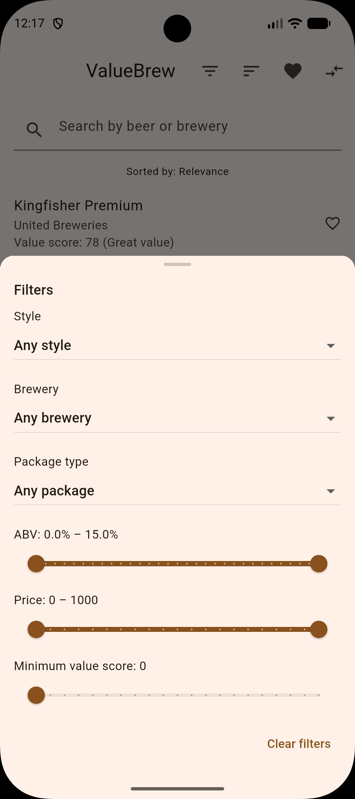
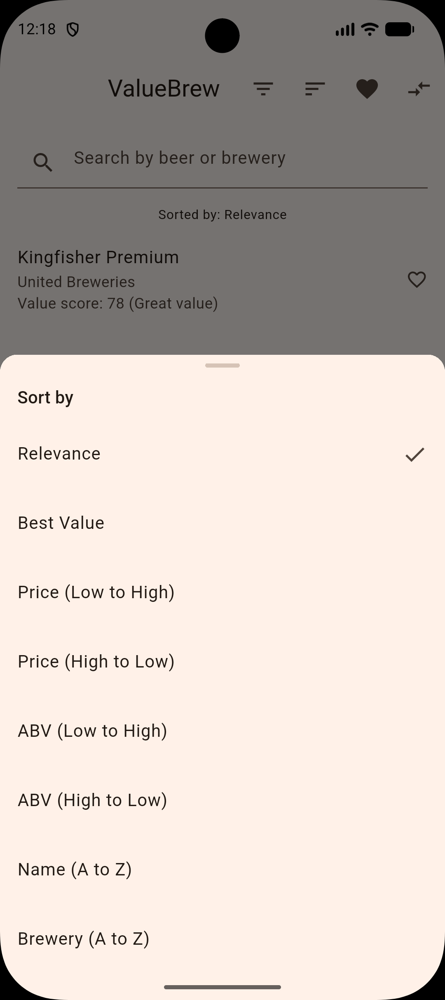
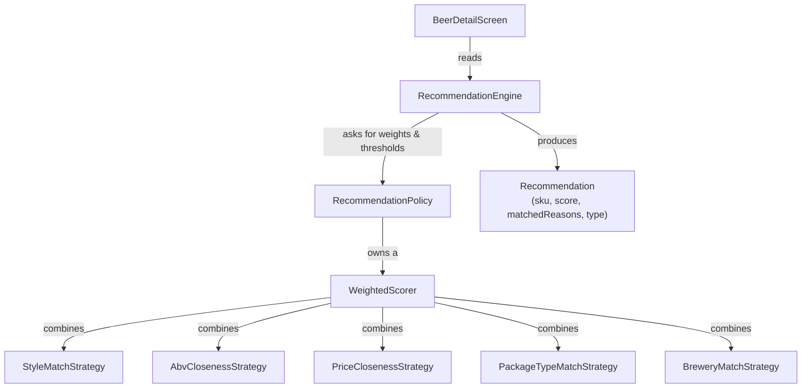

# ValueBrew

**Know what you're really paying for.** ValueBrew compares beers on cost
per litre and cost per millilitre of alcohol — not just sticker price —
so a cheap large bottle and a pricier strong can are finally comparable
on the same terms.

No account. No ads. No tracking. Just a catalog, a value score, and
explanations you can actually check.

<!--
Screenshots: capture per the checklist in store_listing.md, then replace
this block with actual images, e.g.:

<p align="center">
  
  
  
  
</p>
-->
📱 *Screenshots coming soon — see [`store_listing.md`](store_listing.md) for the capture checklist.*

---

## Features

- **Value scoring** — every SKU gets a cost-per-litre and
  cost-per-mL-of-alcohol breakdown, plus a plain-language verdict (Great
  value, Fair value, …).
- **Search** — typo-tolerant fuzzy matching over beer name and brewery.
- **Filtering** — by style, ABV, price range, and minimum value score.
- **Sorting** — by value, price, or name, on both Home and Favorites.
- **Comparison** — any two beers, side by side.
- **Explainable recommendations** — "Similar ABV", "Better value", and
  friends — never a bare list of suggestions with no reason attached.
  Switchable recommendation profiles let you weight what "similar" means.
- **Favorites** — persisted locally, no account required.
- **"This looks wrong" reporting** — flag bad catalog data for later
  review, recorded on-device only.
- **Remote catalog updates** — the bundled catalog is checked against a
  remotely-hosted version on launch, with a silent, crash-free fallback
  to whatever's already available if the network doesn't cooperate.

## Screenshots

| Home | Beer Details |
|------|--------------|
|  |  |

| Compare | Recommendation Profiles |
|----------|-------------------------|
|  |  |

| Filters | Sorting |
|---------|---------|
|  |  |

## Technology Stack

| Layer | Choice |
|---|---|
| Framework | Flutter 3.44.8 / Dart 3.12.2 |
| State management | [flutter_riverpod](https://pub.dev/packages/flutter_riverpod) 2.6.1 |
| Networking | [http](https://pub.dev/packages/http) 1.2.2 (remote catalog fetch) |
| Local persistence | [shared_preferences](https://pub.dev/packages/shared_preferences) 2.3.3 |
| Filesystem access | [path_provider](https://pub.dev/packages/path_provider) 2.1.5 |
| Static analysis | [flutter_lints](https://pub.dev/packages/flutter_lints) 6.0.0 |

No backend. The catalog is a local JSON file, optionally refreshed from a
static CDN-hosted copy of the same file — see
[Remote Catalog](#remote-catalog) below. Full license text for every
dependency: [`THIRD_PARTY_NOTICES.md`](THIRD_PARTY_NOTICES.md).

## Architecture

```
┌─────────────────────────────────────────────────────────┐
│  UI (ConsumerWidget screens)                             │
│  Home · BeerDetail · Compare · Favorites                 │
└───────────────────────────┬───────────────────────────────┘
                             │ ref.watch / ref.read
                             ▼
┌─────────────────────────────────────────────────────────┐
│  Riverpod Providers                                       │
│  dependency wiring · search · filtering · sorting          │
└───────────┬─────────────────────────────┬─────────────────┘
            │                             │
            ▼                             ▼
┌───────────────────────┐     ┌───────────────────────────┐
│  Repositories           │     │  RecommendationEngine       │
│  CatalogRepository ·    │     │  → RecommendationPolicy     │
│  FavoritesRepository ·  │     │  → WeightedScorer            │
│  WrongReportStore       │     │  → SimilarityStrategy         │
└───────────┬───────────┘     └──────────────┬──────────────┘
            │                                │ (reads, as plain data)
            ▼                                ▼
┌───────────────────────┐     ┌───────────────────────────┐
│  Persistence             │     │  Catalog                    │
│  Bundled asset ·          │◄────  (Beer, Sku, Style,         │
│  SharedPreferences ·      │     Benchmark — value objects)  │
│  Remote HTTP fetch        │     │                              │
└───────────────────────┘     └───────────────────────────┘
```

Feature-first, repository-pattern, dependency-injected throughout — every
repository and service is swappable via Riverpod provider overrides, with
no global singletons and nothing constructed inside a widget's `build()`.

The full reasoning behind these choices — why Flutter, why Riverpod, why
the recommendation engine is SKU-centric rather than Beer-centric, what
each architectural principle looks like in code — is written up in
[`docs/architecture.md`](docs/architecture.md). The engineering workflow
this project is built with (one milestone at a time, verified before it's
considered done) is in [`docs/philosophy.md`](docs/philosophy.md).

### Recommendation Engine, briefly

Recommendations are the one part of the app with real internal layering,
because "recommend a beer" is a weaker product than "recommend a beer and
be able to say why":



- **`RecommendationEngine`** holds zero hardcoded numbers — every weight
  and threshold comes from an injected `RecommendationPolicy`, so a new
  recommendation profile (budget-focused, craft-focused, …) is a new
  policy class, never an engine change.
- **`SimilarityStrategy`** implementations (style, ABV, price, package
  type, brewery) each score *and* explain themselves using the same
  internal comparison — an explanation can never disagree with the score
  that produced it.
- Everything above is plain Dart with no Flutter or Riverpod dependency,
  which is why it's the most heavily unit-tested part of the codebase.

Full depth: [`docs/architecture.md#recommendation-architecture`](docs/architecture.md#recommendation-architecture).

### Remote Catalog

On launch, `CatalogRepository` tries, in order: the bundled JSON asset
(the only failure that actually stops loading), a locally-cached catalog
if it's newer, then a remote fetch (`HttpCatalogRemoteSource`) if *that*
reports something newer still. Any failure reading the cache or the
network — offline, timeout, a non-200 response, malformed JSON — is
silently ignored; the app just keeps whatever it already has. Configure
the remote URL and timeout in one place:
[`lib/core/constants/app_constants.dart`](lib/core/constants/app_constants.dart).

## Project Structure

```
lib/
  core/
    constants/     — app-wide constants (catalog asset key, remote URL, timeout)
    theme/          — reserved for theme extraction (currently inline in app.dart)
    utils/          — pure functions: fuzzy string matching, display formatting
  data/
    models/         — immutable value objects mirroring the catalog JSON schema
    repositories/   — CatalogRepository
    sources/        — CatalogLocalCache, CatalogRemoteSource (persistence/network boundaries)
  features/
    beer_detail/    — beer detail screen, wrong-report submission
    compare/        — side-by-side beer comparison
    favorites/       — favorites repository, provider, screen
    filtering/       — FilteringEngine, FilterState, the filter bottom sheet
    home/            — the app's entry screen (search + filter + sort + list)
    recommendation/  — the recommendation engine stack (models, policy, scoring, services, providers, widgets)
    search/          — search query + fuzzy-matched results provider
    shared/          — catalog lookups, the catalog provider, shared widgets
    sorting/         — SortingEngine, SortOption, the sort bottom sheet
  app.dart, main.dart
```

See [`docs/architecture.md`](docs/architecture.md) for why the structure
is shaped this way (in particular, why there's no `features/catalog/`
folder, and why `recommendation/` is the one deeply-layered module).

## Testing Strategy

**467 tests**, all passing, `flutter analyze` clean — both are a hard
gate in this project's workflow; a milestone isn't complete until both
pass.

- **Unit tests** (the large majority) — data models, core utilities, and
  the heaviest-tested area, the recommendation stack (every
  `SimilarityStrategy`, `WeightedScorer`, `RecommendationPolicy`,
  `RecommendationEngine`), plus `FilteringEngine` and `SortingEngine`.
- **Widget tests** — `HomeScreen`, `BeerDetailScreen`, `CompareScreen`,
  `FavoritesScreen`, each using `ProviderScope` overrides to inject fake
  repositories/engines rather than touching real assets, `SharedPreferences`,
  or the network.
- **Provider tests** — where the thing worth testing is composition/wiring
  itself, not business logic already covered at the unit level.
- **Repository tests** — `SharedPreferences`-backed repositories tested
  against `SharedPreferences.setMockInitialValues({})`, including
  "survives recreation" cases as a local proxy for "survives an app
  restart".

Run everything:

```bash
flutter analyze
flutter test
```

## Setup Instructions

1. Install [Flutter](https://docs.flutter.dev/get-started/install) 3.44.8
   or later (stable channel).
2. Clone the repository and install dependencies:

   ```bash
   flutter pub get
   ```

3. Run the app on a connected device or simulator:

   ```bash
   flutter run
   ```

4. Run the test suite and static analysis:

   ```bash
   flutter test
   flutter analyze
   ```

### Regenerating brand assets

The launcher icon (adaptive, monochrome, and legacy) and splash-screen
foreground are generated from one vector mark defined in code, not
hand-exported PNGs:

```bash
flutter test tool/generate_brand_assets.dart
```

Edit the mark in `tool/generate_brand_assets.dart` and re-run this to
regenerate every density.

## Release Instructions

Full release process: [`release_checklist.md`](release_checklist.md).
Signing a real release build: [`docs/RELEASE_SIGNING.md`](docs/RELEASE_SIGNING.md).

Short version:

```bash
flutter build appbundle --release   # Play Store upload format
flutter build apk --release         # a signed APK
```

Without `android/key.properties` present, release builds fall back to
debug signing (so the commands above always succeed locally) — see
`docs/RELEASE_SIGNING.md` for generating and wiring up a real release key.

## Roadmap

Ordered by what the codebase has already been explicitly built to
support but hasn't yet implemented — see
[`docs/architecture.md#extension-points`](docs/architecture.md#extension-points)
for how each one plugs into what exists today:

1. Personalization using Favorites (the signal already exists; the open
   question is how it should influence scoring or explanations)
2. Food pairing as a recommendation dimension (blocked on catalog
   schema/data, not architecture)
3. Recently Viewed (a close structural cousin of Favorites)
4. Cloud sync for favorites (an interface already sits behind
   `favoritesRepositoryProvider`; a remote-backed implementation slots in
   without touching any screen)

## Privacy

ValueBrew collects no personal data, runs no analytics, shows no ads, and
requires no account. Full policy: [`privacy_policy.md`](privacy_policy.md).

## License

No open-source license has been selected for this repository yet — all
rights reserved by default until one is chosen. Third-party dependency
licenses (all permissive: BSD-3-Clause / MIT) are documented in
[`THIRD_PARTY_NOTICES.md`](THIRD_PARTY_NOTICES.md).
