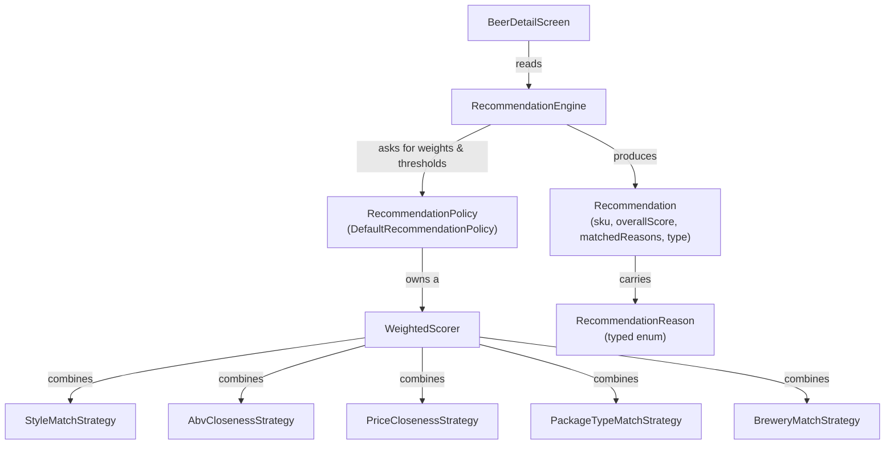
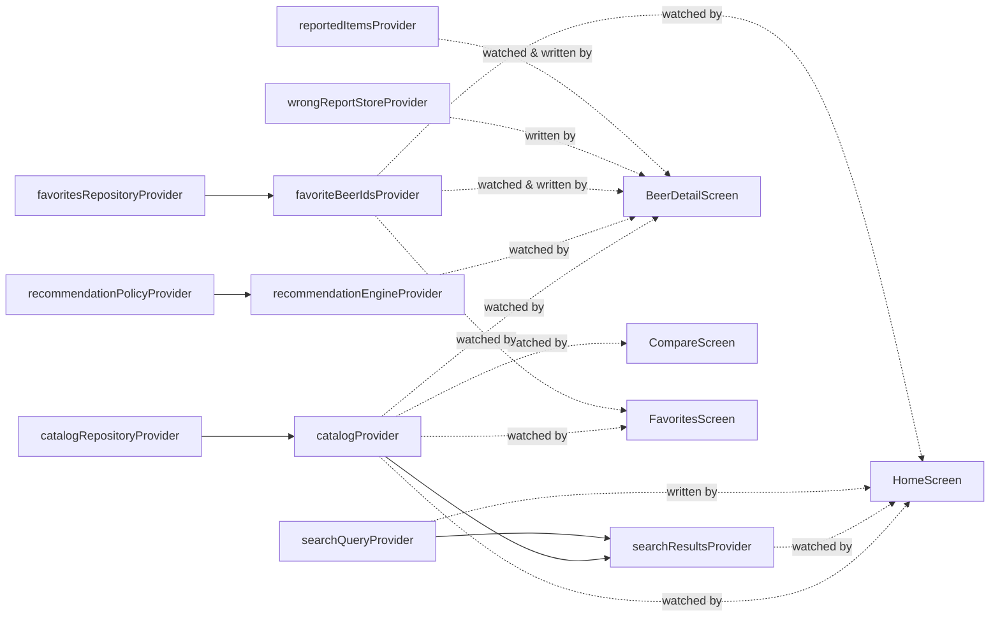

# ValueBrew Architecture

*Last updated against the codebase as of the production-readiness milestone (467 passing tests, `flutter analyze` clean).*

This document explains **why** ValueBrew is built the way it is — not how Flutter works, and not a line-by-line walkthrough. It's written for whoever needs to make a non-trivial change here without re-deriving the reasoning from scratch: future me, a new engineer, a reviewer, or a contributor.

---

## Vision

ValueBrew is becoming an **explainable beer recommendation platform**, not just a beer-price catalog app.

The distinction matters architecturally. A catalog app's hard problem is data (parsing, freshness, presentation). A recommendation platform's hard problem is *justifying its output* — a user should never see a suggested beer without being able to see why it was suggested. That requirement is why this codebase has a dedicated `Recommendation` model carrying a score and a list of typed reasons, rather than recommendation methods that simply return a ranked list of beers. Every decision in the [Recommendation Architecture](#recommendation-architecture) section follows from that one requirement.

Favorites (the most recent milestone) is the first true user-generated signal in the app. It isn't used for personalization yet — but it exists specifically because a "Because you liked Kingfisher Premium…" feature needs a persisted signal to read from, and building that signal cleanly now is cheaper than retrofitting it later. See [Extension Points](#extension-points).

---

## Why Flutter

Flutter was chosen for a single-developer project needing one codebase across iOS and Android, with UI needs (lists, forms, navigation) that are squarely in Flutter's comfort zone rather than pushing against it. The alternative most seriously implied by the rest of this stack — native iOS/Android in parallel — would have meant either double-implementing the entire recommendation stack or pushing it into a shared backend before there's any evidence one is needed yet. A single Dart codebase keeps the model, repository, and recommendation layers written once.

Riverpod fits specifically because this architecture leans on dependency injection and testability more than on visual polish: every repository and service is swappable via provider overrides, with no `BuildContext`-scoped lookups and no global singletons. That's a good match for a codebase where the recommendation engine's correctness matters more than any single screen's appearance.

Material Design was sufficient because ValueBrew has no brand identity to express yet and no platform-specific interaction pattern it depends on — standard widgets (`ListTile`, `AppBar`, `SegmentedButton`) cover every screen built so far without a custom design system.

The honest tradeoff: Flutter's cross-platform rendering means neither iOS nor Android gets a fully native look, and performance-sensitive or platform-specific features (deep OS integration, highly custom animation) would cost more here than in a native app. Given that ValueBrew's differentiated value is *explaining a recommendation correctly*, not *how a list scrolls*, that tradeoff has been the right one so far — architecture, correctness, and test coverage have consistently been prioritized over platform-specific optimization.

---

## High-Level Architecture

```
┌─────────────────────────────────────────────────────────┐
│  UI (ConsumerWidget / ConsumerStatefulWidget screens)    │
│  HomeScreen · BeerDetailScreen · CompareScreen ·         │
│  FavoritesScreen                                         │
└───────────────────────────┬───────────────────────────────┘
                             │ ref.watch / ref.read
                             ▼
┌─────────────────────────────────────────────────────────┐
│  Riverpod Providers                                      │
│  (dependency wiring + derived/computed state)            │
└───────────┬─────────────────────────────┬─────────────────┘
            │                             │
            ▼                             ▼
┌───────────────────────┐     ┌───────────────────────────┐
│  Repositories          │     │  RecommendationEngine      │
│  CatalogRepository ·   │     │  → RecommendationPolicy    │
│  FavoritesRepository · │     │  → WeightedScorer           │
│  WrongReportStore      │     │  → SimilarityStrategy       │
└───────────┬───────────┘     └──────────────┬──────────────┘
            │                                │ (reads, as plain data)
            ▼                                ▼
┌───────────────────────┐     ┌───────────────────────────┐
│  Persistence            │     │  Catalog                   │
│  Bundled asset ·         │◄────  (Beer, Sku, Style,       │
│  SharedPreferences       │     Benchmark — value objects)│
└───────────────────────┘     └───────────────────────────┘
```

The one nuance worth calling out explicitly: **`RecommendationEngine` is not "below" repositories in a strict layered sense — it's a pure function-like service that the UI calls directly, passing in a `Catalog` and a reference `Sku` as plain arguments.** It has no Riverpod dependency, no repository dependency, and no knowledge that a `Catalog` came from `CatalogRepository` at all. This is deliberate: it's what lets the entire recommendation stack (`RecommendationEngine`, `RecommendationPolicy`, `WeightedScorer`, `SimilarityStrategy`) be unit-tested with hand-built in-memory catalogs, with zero mocking of Flutter, Riverpod, or SharedPreferences. The *provider* layer is what connects it to the rest of the app (`recommendationEngineProvider` exposes the engine; screens read `catalogProvider` for the data and pass both into the engine themselves).

---

## Project Structure

```
lib/
  core/
    constants/     — app-wide constants (catalog asset key, remote catalog URL, timeout)
    utils/         — pure functions: fuzzy string matching, display formatting
  data/
    models/        — immutable value objects mirroring the catalog JSON schema
    repositories/   — CatalogRepository (the only repository under data/)
    sources/       — CatalogLocalCache, CatalogRemoteSource (persistence/network boundaries)
  features/
    beer_detail/   — BeerDetailScreen; wrong-report submission
    compare/       — side-by-side beer comparison
    favorites/     — favorites repository, provider, screen
    filtering/     — FilteringEngine, FilterState, the filter bottom sheet
    home/          — the app's entry screen (search + filter + sort + list)
    recommendation/ — the recommendation engine stack (see below)
    search/        — search query + fuzzy-matched results provider
    shared/        — catalog lookups, the catalog provider, shared widgets
    sorting/       — SortingEngine, SortOption, the sort bottom sheet
  app.dart, main.dart
```

(Filtering and sorting followed the same pattern `recommendation/` established — a small, self-contained engine plus its own `models/`/`providers/`/`services/`/`widgets/` — after this document was first written; the split described below still applies to each of them.)

Two things about this structure are worth explaining rather than leaving implicit:

**There is no `features/catalog/` folder.** Catalog concerns are split between `data/` (models, the repository, and its local/remote sources) and `features/shared/` (the provider that exposes it, plus lookup helpers). This is intentional: the catalog isn't a *feature* with its own screen — it's foundational data every other feature depends on. Giving it a home in `data/` (repository pattern, no Flutter dependency) keeps it testable in isolation and signals that it sits a layer below the feature modules, not alongside them.

**`recommendation/` is the largest and most structured feature module**, split into `models/`, `policy/`, `providers/`, `scoring/`, and `services/` — a deliberate exception to the otherwise-flat feature folders (`beer_detail/`, `compare/`, `favorites/`, `home/`, `search/` each have at most a `screens/` and `providers/` subfolder). This reflects that recommendation logic is the one place in the app with real internal architecture worth its own layering — see the next section.

| Module | Responsibility |
|---|---|
| `beer_detail` | Renders a single beer's SKUs, its favorite toggle, "This looks wrong" reporting, and its recommendation sections. Adapts SKU-level recommendation results to a beer-level screen (see [Recommendation Architecture](#recommendation-architecture)). |
| `compare` | Lets a user pick two beers and see their facts side by side. No scoring, no persistence, no recommendation logic — read-only presentation of catalog data. |
| `favorites` | The favorites repository, its Riverpod state, and the dedicated screen listing favorited beers. |
| `home` | The app's entry point: search field, sort control, beer list. Composes `search`'s providers and `favorites`' provider; owns no business logic of its own beyond sort-mode UI state. |
| `recommendation` | Everything that decides *what* to recommend and *why*: engine, policy, scorer, strategies, and the `Recommendation`/`RecommendationReason` models. Has no Flutter dependency anywhere except the provider files. |
| `search` | Query state and fuzzy-matched, ranked search results over the catalog. |
| `shared` | Cross-feature code with more than one consumer: catalog ID-resolution helpers, the catalog provider, and the one shared list-tile widget. |

---

## Architectural Principles

| Principle | Where it shows up |
|---|---|
| **Single Responsibility** | Each `SimilarityStrategy` scores exactly one dimension (style, ABV, price, package, brewery) and nothing else. `WeightedScorer` only combines scores — it doesn't know what a "style" or "ABV" is. `RecommendationEngine` only executes ranking/filtering algorithms — it holds no weights or thresholds itself. |
| **Dependency Injection** | `RecommendationEngine({RecommendationPolicy? policy})`, `CatalogRepository({required loadAsset, required assetKey, localCache, remoteSource})`, `FavoritesNotifier(FavoritesRepository)` — every service takes its dependencies through its constructor, defaulting to the production implementation. Nothing is a global singleton; everything is swappable in tests via Riverpod overrides. |
| **Repository Pattern** | `CatalogRepository` and `FavoritesRepository` are the persistence boundary for their domains — no widget calls `SharedPreferences` or `rootBundle` directly. `WrongReportStore` plays the same role for wrong-reports, informally. |
| **Strategy Pattern** | `SimilarityStrategy` and its five implementations (`StyleMatchStrategy`, `AbvClosenessStrategy`, `PriceClosenessStrategy`, `PackageTypeMatchStrategy`, `BreweryMatchStrategy`) are the textbook case: `WeightedScorer` holds a `Map<SimilarityStrategy, double>` and iterates it, never a `switch` on strategy type. |
| **Riverpod state management** | Four provider shapes are used, each for a specific reason — see [State Management](#state-management). |
| **Composition over inheritance** | There is no inheritance hierarchy anywhere in the recommendation stack. `WeightedScorer` *has* multiple strategies (composition), it doesn't subclass them. `RecommendationEngine` *has* a policy, it isn't specialized per policy via subclassing. `DefaultRecommendationPolicy` *has* a `WeightedScorer` plus scalar thresholds; a future `BudgetDrinkerPolicy` would `implements RecommendationPolicy` directly, not extend `DefaultRecommendationPolicy`. |

---

## Recommendation Architecture

This is the largest and most deliberately layered part of the app.



**`RecommendationEngine`** — the executor. It has exactly two methods:
- `similarBeers(Sku, Catalog) → List<Recommendation>` — ranks every other SKU by similarity, no filtering beyond the policy's `minSimilarityScore` (which defaults to `0.0`, i.e. no filtering at all).
- `betterValueAlternatives(Sku, Catalog) → List<Recommendation>` — a same-style, comparable-ABV, genuinely-higher-`valueScore` gate, ranked by `valueScore` descending.

It contains **zero hardcoded numbers**. Every weight and threshold it needs, it asks its injected `policy` for. This is the direct result of a milestone whose explicit goal was "the engine should never know numerical weights" — before that, the weights and ABV tolerance were `static const` fields on the engine itself.

**`RecommendationPolicy`** — the rules. An interface (`similarityScorer`, `minSimilarityScore`, `comparableAbvTolerance`, `minValueScoreImprovement`) with one production implementation, `DefaultRecommendationPolicy`, whose values reproduce the engine's original hardcoded behavior exactly (this was a hard requirement when the policy layer was extracted — "no functional regression"). A future recommendation profile (Budget Drinker, Craft Explorer, Session Beers, …) is a *new class implementing this interface* — `RecommendationEngine` never changes to support one.

**`WeightedScorer`** — combines multiple `SimilarityStrategy` scores into one `[0.0, 1.0]` number via a weighted average, normalizing by the sum of weights so callers don't need weights to sum to any particular total. This is the one place scores are combined; adding, removing, or reweighting a dimension is a one-line change to a weight map, never a change to a strategy's own code.

**`SimilarityStrategy`** — one comparison dimension per implementation. Each strategy has two methods: `score()` (the `[0,1]` similarity number `WeightedScorer` uses for ranking) and `explain()` (a `RecommendationReason?` — non-null when the comparison is strong enough to be worth telling a user about). Both methods call the *same* private comparison helper internally (e.g. `_stylesMatch`), so the explanation can never disagree with the score that produced it — there is no separate, independently-maintained "explanation logic."

**`Recommendation`** — what the engine actually returns: the `Sku`, the `overallScore` it was ranked by, its `matchedReasons` (a `List<RecommendationReason>`, possibly empty), and a `RecommendationType` (`similar` or `betterValue`) recording which method produced it.

**`RecommendationReason`** — a closed, typed enum (`sameStyle`, `sameBrewery`, `similarAbv`, `similarPrice`, `samePackage`, `betterValue`), each with a `displayLabel` extension for UI text (e.g. "Same style"). No raw strings ever cross the engine/UI boundary for a reason.

### Explainability, precisely

For `similarBeers`, `matchedReasons` comes from `WeightedScorer.explain()`, which asks every strategy in its weight map for its own `explain()` result and collects the non-null ones — in the exact order the weight map iterates. The two continuous-valued strategies (ABV and price closeness) use a fixed `0.5` "worth mentioning" threshold (half of that strategy's own configured max-difference bar) — a deliberately simple, single constant per strategy, not exposed through `RecommendationPolicy`.

For `betterValueAlternatives`, there is **no `WeightedScorer` involved in ranking at all** — it never was; that method is a hand-rolled style/ABV/value-improvement gate, not a weighted score. Its `matchedReasons` is therefore a single fixed constant list (`[sameStyle, similarAbv, betterValue]`), attached to every result — because every result in that list already satisfies all three conditions by construction of the filter that produced it. There's nothing left to compute per candidate.

Both methods compute score and explanation **together, in the same per-candidate pass** — never as a first pass to rank, then a second pass to explain. This was an explicit requirement (avoiding "recompute explanations separately from recommendations") and is implemented via a Dart record type holding `(score, reasons)` per candidate, built once.

### Why recommendation logic lives outside the UI

Two reasons, in order of importance:

1. **The whole engine is unit-testable without a widget tree.** `RecommendationEngine`, `RecommendationPolicy`, `WeightedScorer`, and every `SimilarityStrategy` take plain `Sku`/`Catalog` values and return plain values — no `BuildContext`, no provider container, no async gap. The bulk of this codebase's 296 tests exist at this layer specifically because ranking and explanation logic has many interacting numeric thresholds where a UI smoke test would never catch a subtle regression (e.g. a policy change accidentally reordering results).
2. **Explanations need to be inspectable independent of rendering.** A `Recommendation`'s `matchedReasons` is a real, typed list that a test can assert on directly — `find.text('Same style • Similar ABV')` only proves the *UI* renders correctly; the *engine* tests are what prove the reasons are actually correct.

### Why `RecommendationEngine` is SKU-centric

Price, ABV, package type, and cost-per-ml-alcohol — the actual axes every strategy compares — are **SKU-level** attributes, not beer-level ones. A single `Beer` ("Kingfisher Premium") can have a 650ml bottle and a 330ml can with different prices, different value scores, and (rarely) different ABV. There is no single meaningful "this beer's price" to compare; there's only "this SKU's price." Building the engine around `Sku` rather than `Beer` means every comparison it makes is comparing like-for-like, real, purchasable things — not an average or an arbitrarily-chosen representative smuggled in behind the scenes.

### Why `BeerDetailScreen` adapts SKU results to Beer UI

`BeerDetailScreen` is beer-centric — it's how the rest of the app navigates (tapping a beer, not a SKU) and it doesn't yet have SKU selection. Since the engine needs *a* reference `Sku`, the screen picks one itself: the beer's highest-`valueScore` SKU (via the existing `bestSkuForBeer` helper) — the same SKU the screen already used for ranking before the engine existed. This choice lives entirely in the screen, not the engine, which is the point: it's a UI-layer decision about how to represent "this beer" to a SKU-shaped API, and it's visible and named at the one call site that needs to make it, rather than hidden inside the engine as an implicit default.

The screen also filters out any recommendation whose SKU belongs to the *same* beer being viewed (`recommendation.sku.beerId != beer.id`) — because the engine only ever excludes the exact reference SKU it was given, not every sibling SKU of the same beer (that's deliberate, tested engine behavior: it's SKU-level all the way through). Without this filter, a beer with two SKUs would recommend itself. This, too, is adaptation logic that belongs to the screen, not the engine — the engine has no concept of "this candidate happens to be the same beer," because it has no concept of "beer" as a UI-facing grouping at all.

---

## State Management

Four provider *shapes* are used, chosen deliberately per need:

| Shape | Used for | Providers |
|---|---|---|
| `Provider<T>` | Constructing/exposing a stateless dependency | `catalogRepositoryProvider`, `recommendationPolicyProvider`, `recommendationEngineProvider`, `favoritesRepositoryProvider`, `wrongReportStoreProvider`, `searchResultsProvider` |
| `FutureProvider<T>` | A genuine one-shot async load | `catalogProvider` |
| `StateProvider<T>` | A plain, directly-settable value with no behavior attached | `searchQueryProvider`, `reportedItemsProvider` |
| `StateNotifierProvider<N, T>` | State with real behavior (guard clauses, persistence side effects) attached | `favoriteBeerIdsProvider` |

Grouped by feature:

**shared** — `catalogRepositoryProvider` (constructs the production `CatalogRepository`) → `catalogProvider` (loads and exposes the parsed `Catalog`; every other data-dependent provider composes this rather than loading anything itself).

**search** — `searchQueryProvider` (raw typed text) + `catalogProvider` → `searchResultsProvider` (fuzzy-matched, ranked `List<Beer>`, wrapped in the same `AsyncValue` `catalogProvider` produces, via `whenData`).

**recommendation** — `recommendationPolicyProvider` (the default policy) → `recommendationEngineProvider` (an engine configured with whatever policy is currently provided). Overriding the policy provider alone changes every recommendation, without touching the engine provider.

**favorites** — `favoritesRepositoryProvider` (the production repository) → `favoriteBeerIdsProvider` (a `StateNotifier` holding the in-memory `Set<String>`, loaded once at construction).

**beer_detail** — `wrongReportStoreProvider` (the store) and `reportedItemsProvider` (a session-only `Set<String>` of already-reported keys — deliberately *not* reloaded from the store, since duplicate prevention only needs to hold within one session).



No provider is ever constructed inside a widget's `build()` — every dependency is either read via `ref.watch`/`ref.read` or composed from another provider.

---

## Persistence

Three independent local persistence concerns exist today; there is no backend and no networking (the V1 scope explicitly excludes both).

**Catalog** — a three-tier fallback: (a) the bundled asset (`catalog/catalog.json`) is the guaranteed baseline and the only layer whose failure actually stops loading; (b) a `SharedPreferencesCatalogLocalCache` holds a previously-fetched remote catalog, used only if its `catalog_version` is newer than what's already loaded; (c) a `CatalogRemoteSource` — `HttpCatalogRemoteSource` in production, fetching `AppConstants.remoteCatalogUrl` with a configurable timeout — is checked last. A failure reading the cache or the remote source (network unavailable, timeout, a non-200 response, or an unparseable/malformed body) is always silently ignored — the catalog fallback chain is designed so a flaky network or corrupted cache entry never blocks the app from showing the bundled data.

**Favorites** — a `Set<String>` of `Beer.id` values only, under one `SharedPreferences` key (`favorite_beer_ids`). **Only IDs are stored, never whole `Beer` objects**, for the same reason every other reference in this codebase's data model is an ID rather than an embedded object (`Sku.beerId`, `Beer.styleId`): the catalog is the single source of truth for a beer's name, brewery, and style. Persisting a full `Beer` snapshot would duplicate that data and let it drift out of sync the moment the catalog updates (a renamed beer, a corrected brewery) — the ID is a stable reference that's always re-resolved against whatever catalog is currently loaded.

**Wrong Reports** — an append-only list of JSON-encoded `WrongReport`s under `wrong_reports`, via `WrongReportStore`. This is explicitly a V1 placeholder for what the product scope describes as a report that "routes to founder" — there is no delivery mechanism (no networking, no webhook) here yet; reports are recorded locally for manual review. Duplicate-submission prevention (`reportedItemsProvider`) is intentionally session-only, not reloaded from the store, since the requirement was "don't let me report the same SKU twice in one sitting," not "remember forever what I've reported."

---

## UI Philosophy

**Minimal Material UI.** Every screen uses the default `ThemeData`, standard widgets (`ListTile`, `IconButton`, `SegmentedButton`, `AlertDialog`, `Scaffold`/`AppBar`), and no custom design system, custom painting, or animation. This has been a consistent, deliberate constraint across every UI milestone — including Favorites, whose heart icon is explicitly the stock `Icons.favorite`/`Icons.favorite_border` pair with no transition animation.

**Business logic outside widgets.** Every screen's `build()` method reads already-computed values from providers/services and renders them; it doesn't compute them. Sorting (`_sortedByValue` in `home_screen.dart`), filtering (`_filterBeers` in `search_providers.dart`), and all scoring/ranking/explanation live in provider or service files. The one recurring exception is small, explicitly-documented UI-level *adaptation* (e.g. `BeerDetailScreen`'s same-beer-SKU filter) — never a rule that changes what "similar" or "better value" means.

**Reusable widgets, but only past the two-call-site bar.** This codebase's convention is a plain top-level function taking already-resolved data (`buildBeerColumn` in `compare_screen.dart`, `buildBeerListTile` in `shared/widgets/`), not a custom `StatelessWidget` subclass — and these only get extracted once something is genuinely used in two places, never speculatively.

**`buildBeerListTile`** is the single shared row implementation for `HomeScreen` and `FavoritesScreen` — one place that decides what a beer row looks like (name, brewery, best value score, a trailing heart indicating favorite status), so a future visual change to that row never needs to be made twice, and the two screens can never visually drift apart by accident.

**Why `BeerDetailScreen` remains "dumb."** It takes a `Beer` directly (no ID lookup, no route argument parsing), and every non-trivial decision — what's similar, what's better value, why — is delegated to the recommendation layer via `recommendationEngineProvider`. Its own code is limited to resolving catalog lookups (`resolveStyle`, `resolveSkus`, `bestSkuForBeer`) and the two thin, explicitly-documented adaptations described above (reference-SKU selection, same-beer filtering). It never calculates similarity, never inspects styles for ranking purposes, and never ranks beers itself — those responsibilities belong exclusively to `RecommendationEngine`.

---

## Testing Strategy

**296 tests total** (248 unit-style, 48 widget-style), all passing, `flutter analyze` clean — both are a hard gate: per this project's own engineering guide, a milestone isn't complete until both pass.

- **Unit tests** — the large majority. Data models (`fromJson`/`toJson`/equality/`copyWith` for `Beer`, `Sku`, `Style`, `Benchmark`, `Catalog`), core utilities (fuzzy matching, display formatting), and — the heaviest-tested area — the recommendation stack (`SimilarityStrategy`, `WeightedScorer`, `RecommendationPolicy`, `RecommendationEngine`, `Recommendation`).
- **Widget tests** — `HomeScreen`, `BeerDetailScreen`, `CompareScreen`, `FavoritesScreen`, each using `ProviderScope` overrides to inject a fake `CatalogRepository` (and, where relevant, a fake `RecommendationEngine`/`RecommendationPolicy`/`FavoritesRepository`) rather than touching real assets or `SharedPreferences`.
- **Provider tests** — `ProviderContainer` + overrides, used where the thing worth testing is composition/wiring itself (e.g. `catalogProvider` correctly delegates to whatever `catalogRepositoryProvider` currently provides; `favoriteBeerIdsProvider`'s state updates and persistence interaction) rather than re-testing business logic already covered at the unit level.
- **Repository tests** — `SharedPreferences`-backed repositories are tested against `SharedPreferences.setMockInitialValues({})`, including a "survives recreation" case for `FavoritesRepository` (a fresh instance reading what a previous one wrote — the local proxy for "survives an app restart").

**Why this was prioritized:** the recommendation layer in particular has many interacting numeric thresholds (five strategy weights, an ABV tolerance, a value-improvement minimum, two explain thresholds) where a UI-only smoke test would never catch a subtle ranking regression. The test suite is what let several milestones credibly claim "no functional regression" (extracting `RecommendationPolicy` out of a previously-hardcoded engine; changing both engine methods' return type from `List<Sku>` to `List<Recommendation>`) by re-running the *same* assertions against the *new* code path, not by inspection alone.

---

## Key Design Decisions

| Decision | Reason | Alternative Considered |
|---|---|---|
| `RecommendationEngine` methods return `List<Recommendation>` instead of `List<Sku>` | Score and explanation must travel with each result, computed together, not as a second pass | A parallel `...WithExplanations` API alongside the original `List<Sku>` methods — rejected: either two computations of the same ranking, or a stale method nobody uses |
| Favorites persist only `Beer` IDs | The catalog is the single source of truth for every other beer field; an ID is a stable reference | Persisting serialized `Beer` snapshots — rejected: would drift from the catalog after any catalog update |
| Recommendation explanations come from `SimilarityStrategy.explain()`, not a separate rules layer | One source of truth per comparison; an explanation can never disagree with the score it's explaining | A standalone explanation pass re-deriving reasons from raw `Sku` fields — rejected: duplicates comparison logic, could silently drift from scoring |
| `RecommendationEngine` operates on `Sku`, not `Beer` | Price, ABV, and package type — the actual comparison axes — are SKU-level attributes; a beer can have several | A beer-level engine with an internally-chosen representative SKU — rejected: hides a real, screen-specific decision inside the engine instead of at the UI boundary that actually needs to make it |
| `RecommendationPolicy` separates rules from `RecommendationEngine` | Lets future recommendation profiles exist as new policy objects, with zero engine changes | Configuration parameters directly on `RecommendationEngine` — rejected: doesn't scale past one or two variants, and conflates "how to execute" with "what the rules are" |
| Riverpod providers wrap every repository/service; none is constructed inside a widget | Testability (override any provider) and a single owner of construction | Instantiating repositories directly in `initState`/`build` — rejected: untestable without real `SharedPreferences`/assets, and duplicated construction per screen |
| `WeightedScorer` combines strategies via a weight map, not a `switch` | Adding, removing, or reweighting a dimension is a one-line change to a map | A large conditional scoring function — rejected: doesn't compose, grows harder to test with every new dimension |
| `betterValueAlternatives`' `matchedReasons` is a fixed constant, not per-candidate strategy calls | Every result already satisfies all three gate conditions by construction of its own filter | Re-deriving reasons via `SimilarityStrategy` calls — rejected: adds cost and an implicit dependency on strategies for a method deliberately designed not to use `WeightedScorer` at all |

---

## Extension Points

None of the following are implemented. Each is described in terms of where it plugs into what already exists.

- **Recommendation Profiles** (Budget Drinker, Craft Explorer, Session Beers, …) — implement `RecommendationPolicy` and override `recommendationPolicyProvider`. Zero changes to `RecommendationEngine`, `WeightedScorer`, or any screen. This is the extension point the policy layer was built for.
- **Personalization ("Because you liked…")** — `favoriteBeerIdsProvider` already exposes exactly the signal this needs (a `Set` of favorited beer IDs). A personalization-aware policy, or a new `SimilarityStrategy`/`RecommendationReason` recognizing "matches a beer you've favorited," could read it without any change to how favorites are persisted.
- **Cloud Sync** — `FavoritesRepository` is already an interface with one local implementation. A remote-backed implementation slots in behind `favoritesRepositoryProvider`; `FavoritesNotifier` and every screen consuming `favoriteBeerIdsProvider` need no changes.
- **Filtering** (by style, ABV, price range, etc.) — would live as a new provider composing `catalogProvider` (and, if combined with search, `searchResultsProvider`), the same way `searchResultsProvider` itself composes `catalogProvider` + `searchQueryProvider` today.
- **Food Pairing** — once pairing data exists in the catalog schema, this is a new `RecommendationReason` value plus one new `SimilarityStrategy` implementation. The strategy interface was explicitly designed (see its own doc comments) so adding a dimension never requires touching an existing strategy or `WeightedScorer`.
- **Recently Viewed** — structurally identical to Favorites (an ordered set of beer IDs, a repository, a provider). The Favorites implementation is a direct template, down to the "persist IDs only" decision.

---

## Technical Debt

Genuine, current limitations — not hypothetical future problems.

- **`RecommendationEngine`'s two methods each hand-write their own candidate-filtering logic.** Not a problem at two methods, but a third recommendation type would start to want a shared filter/rank scaffold rather than a third bespoke implementation.
- **Reference SKU selection is a placeholder.** `BeerDetailScreen` always uses a beer's highest-`valueScore` SKU as the reference for recommendations — there's no real SKU selection UI yet, so every recommendation a user sees is implicitly "recommended relative to your best-value pack size," which may not be the pack size they're actually looking at.
- **`RecommendationReason` is qualitative only.** It's a flat enum with a fixed display label per value ("Similar ABV") — it doesn't carry the underlying numbers (e.g. "4.8% vs 5.0%"). Fine for today's scope, but a real simplification if richer explanations are ever wanted.
- **The `0.5` "worth mentioning" explain threshold is an untuned constant**, duplicated as a private constant in both `AbvClosenessStrategy` and `PriceClosenessStrategy`, with no product research behind the specific number and no policy-level override.
- **`BeerDetailScreen` repeats its same-beer-SKU filter twice** (once for each recommendation section) rather than factoring it into one helper — small, but a real, literal duplication of one line.

---

## Future Roadmap

Ordered by what the codebase has already been explicitly built to support but hasn't yet implemented:

1. **A first real recommendation profile** — the most natural next milestone, since `RecommendationPolicy` exists specifically to make this a low-risk, additive change.
2. **Personalization using Favorites** — the signal now exists; the next step is deciding how it should influence scoring or explanations.
3. **Filtering / sorting on Home** — a natural extension of the existing search-provider composition pattern.
4. **Food pairing as a recommendation dimension** — blocked only on catalog schema/data, not on architecture.
5. **Recently Viewed** — a close structural cousin of Favorites.

---

## Architecture Summary

ValueBrew is built around one central bet: **recommendation logic must be explainable, testable in isolation, and swappable without touching the UI.** That bet shows up everywhere. `RecommendationEngine` holds no business rules — `RecommendationPolicy` does, specifically so a new recommendation profile is a new class, not a rewrite. `SimilarityStrategy` and `WeightedScorer` use composition (a strategy map, not a type hierarchy) so a new comparison dimension is a one-class addition. Every `SimilarityStrategy` explains itself using the same logic it scores itself with, so an explanation can never contradict the ranking it's justifying. And the entire stack is plain Dart with zero Flutter or Riverpod dependency, which is *why* it has the test coverage it does — nothing about validating a scoring change requires a widget tree.

The rest of the app is intentionally unambitious by comparison: minimal Material UI, no custom design system, repositories behind Riverpod providers for every piece of persistence, and screens that stay "dumb" — reading already-computed state and rendering it, never deciding anything a service or provider should decide instead. That asymmetry is deliberate. The hard, differentiating problem ValueBrew is solving is *why should I trust this recommendation*, not *how should this screen look* — so that's where the architectural investment went.
