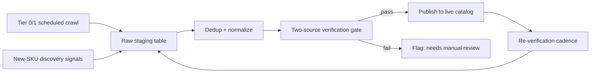

# Deliverable 4 — Catalog Acquisition Playbook

# ValueBrew Catalog Acquisition Playbook

This is the operating manual for how ValueBrew builds, verifies, and maintains the Karnataka beer master database — not a one-time scrape, but a repeatable pipeline. It's built directly from what this session's research actually proved works, is broken, is stale, or is legally risky. No source below is theoretical; every claim about a site's behavior (uptime, robots.txt, API shape, data quality) is from a direct fetch done this session.

---

## 1. Source tiers — what each source is actually for

Do not treat all sources as equal inputs into one pipeline. Rank them by what they're *reliable for*, not by how much data they return.

**Tier 0 — Regulatory/pricing source of record (Karnataka-specific, government-issued)**
- **KSBCL (ksbcl.karnataka.gov.in)** — Supplier-wise Item-wise Price List. This is the only source in the corpus that ties a beer SKU to a real KSBCL Supplier Code, brewery/bottler entity, and a Karnataka-legal price. Every SKU in our DB that is sold in Karnataka retail should ultimately reconcile to a KSBCL line item. Use it as the **price and legal-entity ground truth**, not for ABV/style/imagery (KSBCL doesn't publish those).
- **United Breweries Regulation 30 (SEBI) PDF filings** (`unitedbreweries.com/pdf/Material Events/`) — the single highest-confidence source for *launch dates* and, occasionally, exact Karnataka per-SKU pricing (e.g. Kingfisher Smooth: ₹100/330can, ₹120/330btl, ₹155/500can, ₹200/650btl). Treat as authoritative for "when did this SKU legally enter Karnataka" and cite the filing PDF, not a paraphrase.

**Tier 1 — Retail catalog (breadth + price cross-check)**
- **Madhuloka (madhuloka.com)** — ~103 beer SKUs, fully server-rendered HTML, no bot-blocking observed, permissive robots.txt, working `/shop/category/beer-3/page/N` pagination. This is the best day-to-day scraping target for brand/size/price. Weaknesses proven this session: no ABV field on any product page checked; duplicate/split SKU rows for the same product at different prices (e.g. two "Heineken Silver" rows, two "Knock Out Tin" rows) that must be deduped, not appended as separate SKUs.
- **Onlinealcohol.in** — small beer catalog (12 SKUs) but the *only* retailer with a genuinely working JSON API (`/wp-json/wc/store/v1/products`). Use as a low-effort cross-check for price drift on the SKUs it does carry, not as a primary catalog.
- **Beerbasket.in** — HTML scraping of `/type/domestic-indian-beer/` only (its Store API 500s); treat as tertiary corroboration, low weight, given the site's SEO-mill quality signals.

**Tier 2 — Brand/spec metadata (ABV, style, package sizes — NOT price)**
- Official brand pages: `unitedbreweries.com/our-brands`, `heineken.com/in/en/our-products/*`, `carlsbergindia.com/products/*`, `mounteverestbreweries.com/products/stok/`. These give ABV/calories/pack sizes but almost never Karnataka-specific pricing or availability. Use to enrich SKUs already discovered via Tier 0/1, not to discover new ones (they don't list distribution footprints reliably).
- **Caveat to bake into the pipeline**: at least one official page (STOK's) contradicts itself (spec table says 7% ABV, FAQ says 8%) — never accept a single-page fact at face value; require two independent hits (see §3).

**Tier 3 — Bootstrap / identifier enrichment (free, commercially reusable, but unverified completeness)**
- **Open Food Facts** — free ODbL/CC-BY-SA data, confirmed live GTINs for Kingfisher (8905002180007), Bira Boom (8908005126324), Tuborg, Budweiser India, Coolberg. Use as the seed for GTIN/barcode fields. Known defects to filter for: category mistagging (a Cadbury bar tagged "Beers"), brand-name mismatch ("Bira 91" returns 0 hits, "Bira" returns hits), and blank ABV/nutriment fields on most Indian entries.
- **GS1 India DataKart** — no public API; only path in is a paid "DataKart for Solution Providers" relationship (pricing undisclosed, contact registration@gs1india.org / implementation@gs1india.org). Don't build automation against it; treat as a future paid-partnership line item if barcode coverage becomes a blocker.

**Do-not-use / disqualified this session (recheck later, don't build against now)**
- **livingliquidz.com** — HTTP 503 "under maintenance" on every path, every retry. Not usable today.
- **bira91.com** — serves a broken Apache default page with a mismatched TLS cert (`*.ksmart.live`); not Bira's actual site right now.
- **Zauba.com** — technically online but shipment records sampled were dated 2013/Nov-2016; footer says "© 2021." Frozen pipeline — do not use for "new SKU" discovery.
- **Tonique.in** — single static price table, Yoast metadata says last modified April 2023, contains a literal leftover "Price list coming soon" string. Treat any price pulled from here as unverified until cross-checked elsewhere.
- **Livcheers.com** — explicitly disallows `/api/` in robots.txt and hard-blocks a named list of scraping bots (GPTBot, Bytespider, AhrefsBot, etc.). Do not scrape; respect the stated policy.

---

## 2. The acquisition pipeline (steady-state operation)

**Step-by-step:**

1. **Scheduled crawl (automated).** Madhuloka category pages (paginated) + KSBCL price list page, pulled on the cadence in §4. Store raw HTML/JSON snapshots with a timestamp and source URL — never overwrite, always append, so you can diff week-over-week.
2. **New-SKU discovery signals (semi-automated, see §5).** UBL Reg-30 PDF folder, Carlsberg India newsroom, brand-site "our brands" pages, and Madhuloka's `?search=` + sitemap diffing.
3. **Dedup + normalize.** Collapse near-duplicate rows (this session's catalog already contains this exact problem — e.g. two "Heineken Silver" Madhuloka rows with no size differentiator, two "Knock Out Tin" rows) into one canonical SKU + a price-history array, keyed on `(brand, product_name_normalized, package_size, package_type)`. If size/type is genuinely unknown, mark the record `size: unverified` rather than guessing — several source rows already show this ambiguity ("KF PREMIUM PINT" with no ml value; "HEINEKEN SILVER" with three different prices and no stated size split).
4. **Two-source verification gate** before anything goes live — detailed in §3.
5. **Publish.** Only fields that passed verification get a "Verified" badge; everything else stays "Unverified / single-source" in the live product record, visibly labeled as such. This mirrors how the research reports themselves flagged confidence (High/Medium/Low) — carry that confidence field into the production schema, don't discard it.
6. **Re-verify on cadence.** §4.

---

## 3. Verification protocol — how a price/fact goes live

No single-source fact (price, ABV, size, brewery) should reach a "Verified" state in the live database. Concretely:

**For price (the highest-stakes field, since it's what users act on):**
- Require **agreement between a Tier 0 source (KSBCL) and a Tier 1 source (Madhuloka/onlinealcohol.in)** within the same package size, OR two independent Tier 1 retailer hits.
- If KSBCL and Madhuloka disagree by more than ~10%, do not average them — flag for manual review. KSBCL price is the state-mandated MRP anchor; a materially higher retail price is either a stale KSBCL row, a different SKU/size being conflated, or a genuine local markup — each needs a human to look, not an algorithm to guess.
- Timestamp every price with its source and fetch date. A price with no fetch date is worthless six months from now.

**For ABV/style/brewery:**
- Require the official brand page (Tier 2) AND at least one retailer/KSBCL listing to agree on the brand+package family. If only one source exists (this session hit that repeatedly — e.g. Toit's Basmati Blonde ABV only on Toit's own page, no second confirmation), publish it labeled "Single-source, unverified" rather than silently upgrading it.
- If a source contradicts itself internally (STOK: spec table 7% vs FAQ 8%), do not pick one — record both, flag `internal_inconsistency: true`, and resolve by checking the physical can/bottle label (photograph from a store visit) as the tiebreaker. This is the kind of conflict no scraper resolves; it needs a person with a can in hand.

**For brewery/legal entity attribution:**
- KSBCL Supplier Code is definitive when present (it's a state-issued registration, e.g. "United Breweries Ltd (Nanjangud unit) — KSBCL Supplier Code 0210"). Where KSBCL doesn't cover a SKU (craft/brewpub products like Geist, Toit, Simba), the brewery's own official site is the sole source — label confidence accordingly (this session's Simba/Toit/Geist entries are already correctly marked Medium/Low for exactly this reason).

**For GTIN/barcode:**
- Accept Open Food Facts entries as a seed but mark them `unverified_barcode: true` until cross-checked against a second lookup (Go-UPC) or, ideally, a physical scan. Note the redistribution constraint: **Go-UPC's ToS explicitly prohibit reselling/redistributing/publicly displaying its data** — if you use Go-UPC to *cross-check* a barcode internally, that's fine; do not surface Go-UPC-sourced fields in a public-facing product. Open Food Facts (ODbL/CC-BY-SA) is the only barcode source cleared for redisplay with attribution.

**Anti-bot / ToS discipline baked into verification runs:**
- Respect robots.txt on every crawl (Madhuloka: fully open; Carlsberg India: `Crawl-delay: 10`, so throttle to ~1 req/10s; Livcheers: hard no). A verification pass that gets a source blocked is worse than no verification pass.

---

## 4. Re-verification cadence

Different fields decay at different rates — don't re-check everything on one clock.

| Field | Cadence | Rationale / trigger |
|---|---|---|
| **KSBCL price list** | Weekly automated pull | State price lists change with duty notifications; this is the cheapest, most authoritative source to re-poll and diffing it is the fastest way to catch a price change or a delisted SKU. |
| **Madhuloka / onlinealcohol.in prices** | Weekly automated pull | Retail prices move faster than KSBCL MRPs (local markups, promos). |
| **UBL Reg-30 filings folder** | Weekly check for new PDFs (irregular filing cadence — "multiple per year" per UBL's own pattern) | This is ValueBrew's earliest, highest-confidence signal for a brand-new Karnataka SKU launch — cheaper to catch here than to wait for it to show up in retail. |
| **Carlsberg India newsroom / press pages** | Monthly | Lower filing frequency than UBL; monthly is sufficient given past cadence of announcements (can-line, Karnataka investment pledges). |
| **Brand spec pages (ABV/style) for existing SKUs** | Quarterly | ABV/style rarely change for an established SKU; quarterly catches reformulations without wasting crawl budget. |
| **Full site-health check** (is Madhuloka/KSBCL/Living Liquidz/Bira91.com still reachable/unblocked, has robots.txt changed) | Monthly | This session found two "known good" retail sites (Living Liquidz down, Bira91.com pointing at the wrong server) — site health itself is a moving target and needs its own monitoring, not just content diffing. |
| **Any single-source / Low-confidence record** | Re-attempt second-source corroboration every 2 weeks until resolved or explicitly marked "will remain single-source" | Don't let Low-confidence records rot indefinitely — either promote them or make the decision to leave them Low explicit and dated. |
| **Open Food Facts bulk sync** | Monthly (their own export is nightly, but Indian beer coverage is thin enough that monthly is enough signal) | Crowdsourced data drifts as contributors add records; monthly catches new GTINs without over-polling a rate-limited API (OFF showed intermittent 503s this session — build retry logic, don't treat absence as confirmed absence). |

**Staleness flag rule:** any live record whose price field hasn't been re-confirmed within its cadence window gets a visible "price last confirmed on [date]" badge rather than silently displaying an old number as current. This is non-negotiable for a "most authoritative" positioning — Tonique.in's own site got caught this session showing a 2023-dated table with a leftover "coming soon" placeholder still live; that failure mode is exactly what ValueBrew is positioned to not repeat.

---

## 5. New-SKU discovery and onboarding

Discovery signals, ranked by lead time (earliest warning first):

1. **UBL Regulation 30 filings** (`unitedbreweries.com/pdf/Material Events/`) — a new PDF here means a launch is imminent/just happened, often with exact Karnataka pricing already stated. This is the single best "get there first" signal for the biggest player in the market. Action: pdftotext-extract on new-file detection, auto-draft a new SKU record with `status: pending_retail_confirmation`.
2. **Carlsberg India newsroom** — lower frequency, same pattern.
3. **Madhuloka sitemap diffing** — compare this week's `sitemap.xml` product-URL list against last week's; new URLs under `/shop/category/beer-3/` are candidate new SKUs even before you know the brand filed anything. This catches craft/import SKUs (Simba, Geist, Toit, imported cans) that don't go through SEBI filings at all.
4. **Madhuloka `?search=`** — run scheduled searches for brand names not yet in the catalog (competitor brand names, newly seen import terms from Volza — see below) to catch entry into Karnataka retail even when there's no press signal.
5. **Import-trade signals (imported beer specifically)** — Volza's free-tier "Beer Imports in India" page already surfaced real, brand-identifiable shipment lines (Tusker/Kenya, Saigon Export/Vietnam, Camel/Cheetah/Abest/Vietnam, Sri Lanka canned beer) without a paid account. Use this as a **discovery-only** feed for "a new imported brand is entering the Indian market" — do not build a feature that republishes importer/buyer identity, and get counsel to confirm Section 135AA of the Customs Act, 1962 doesn't cover Volza's bill-of-lading-sourced data before scaling this beyond manual monitoring. Treat DGCI&S as the only *legally uncontestable* channel, but it only gives aggregate volumes, not brand names — so it can't replace Volza/Madhuloka for actual SKU discovery, only corroborate market-size trends.
6. **KSBCL new supplier codes** — if a new KSBCL Supplier Code appears in the price list with no prior history, that's a new bottler/importer entering Karnataka legally — highest-confidence "new brewery" signal available, check immediately.

**Onboarding checklist for a newly discovered SKU:**
1. Create a draft record: brand, product name (raw, as seen), source URL, discovery date, discovery channel.
2. Attempt KSBCL match by brand/size — if found, capture Supplier Code and MRP as Tier 0 anchor.
3. Attempt Madhuloka/onlinealcohol.in match — capture retail price.
4. Attempt brand-site match for ABV/style — if brand site doesn't confirm Karnataka availability specifically (as happened this session with Arbor Brewing's canned beer, which is stated "Retailing only across Goa" despite a Bengaluru brewpub), **do not mark the SKU as Karnataka-available** just because the brewery has a Bengaluru presence. Brewpub presence ≠ retail SKU availability — keep those as two different fields in the schema (`has_bengaluru_taproom: bool` vs `retail_available_karnataka: bool`).
5. Run the two-source verification gate (§3) before flipping `status` from `pending` to `verified`.
6. If only one source ever surfaces after 2 weeks, publish as `single-source / unverified` rather than holding it back indefinitely — partial coverage beats no coverage, as long as it's honestly labeled.

---

## 6. Known data-quality traps to design against (all observed directly this session)

- **Duplicate rows without a differentiator.** Madhuloka served two "Heineken Silver" rows and two "Knock Out Tin" rows with different prices and no visible size distinction. Do not silently merge (you might destroy real size variants) or silently duplicate (you'll double-count SKUs). Force a manual resolution queue for any brand+name collision with >1 distinct price and no size field.
- **Category mistagging in crowdsourced data.** Open Food Facts returned a Cadbury chocolate bar under "Beers." Any OFF import needs a category sanity filter (must have `en:beers` or `en:lagers` tag AND a plausible ABV/ingredient signature) before touching the live catalog.
- **Brand-name normalization gaps.** "Bira 91" as a search term returns zero OFF hits; only "Bira" does. Build a brand-alias table (Bira 91 = Bira = B9 Beverages; UB Export = United Breweries; KF = Kingfisher) and search/match against aliases, not raw strings.
- **Brewpub vs. packaged retail conflation.** Windmills Craftworks and Byg Brewski appear to be on-tap-only venues with no packaged retail product at all — don't list their beers as "available in Karnataka retail" just because they're Karnataka businesses. Add an explicit `channel` field: `retail`, `on-tap-only`, `both`.
- **Stale/placeholder content masquerading as data.** Tonique's price table had a literal "Price list coming soon" string sitting next to real-looking prices. Any static HTML table source needs a staleness heuristic (e.g., reject if page contains "coming soon" language) as an automated guardrail, not just a cadence-based recheck.

---

## 7. Tooling notes (what to actually build, based on what worked this session)

- **BeautifulSoup/requests-class scraper for Madhuloka** — no JS execution needed anywhere in this corpus; every reachable source (Madhuloka, KSBCL, UBL, Carlsberg, Heineken, AB InBev) was server-rendered plain HTML. Don't over-invest in a headless-browser pipeline yet.
- **Odoo age-gate/Cloudflare handling only where required** — UBL's site needs a Drupal age-gate form POST (CSRF `form_build_id` token) before content loads; Cloudflare cookies (`__cf_bm`) are present there, so keep request rates low and expect eventual blocking risk if scraped aggressively — this is a brand/marketing metadata source only, so low-frequency (quarterly, per §4) polling is enough and low-risk.
- **PDF parsing (pdftotext/pdfplumber)** for both UBL's Reg-30 filings and any KSBCL duty-slab PDFs.
- **No JSON API exists for Madhuloka or KSBCL** — plan for HTML scraping as the permanent state for these two Tier 0/1 sources, not a stopgap.

---

**Bottom line for the founder:** the pipeline that actually works today is KSBCL (price/legal truth) + Madhuloka (breadth) + UBL's regulatory PDF folder (earliest-warning for new SKUs), cross-verified against each other before anything is marked "Verified," on a weekly/monthly/quarterly cadence split by field volatility. Everything else in this research — Open Food Facts, Volza, Go-UPC, brand marketing sites — is enrichment or discovery-assist, not something to build core trust on, and two sources (Living Liquidz, Bira91.com) that looked like obvious inputs are currently non-functional and need to be rechecked, not built against, right now.